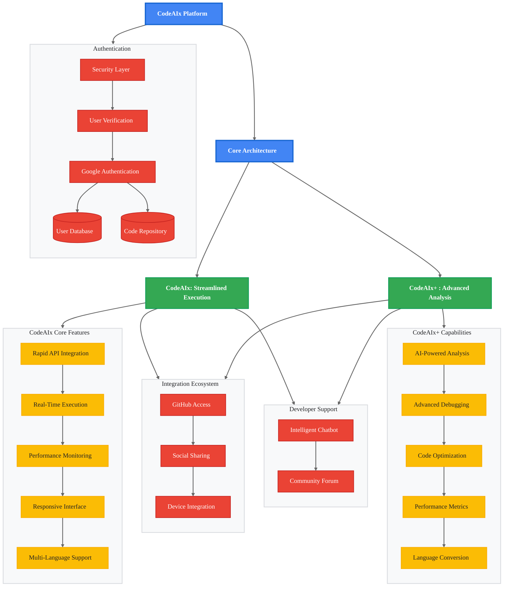

  

## Overview

The CodeAIx platform is a solution designed to cater to the modern developer's needs. It is divided into two distinct models: CodeAIx and CodeAIx+. Each model has been crafted to serve different aspects of the software development lifecycle. While CodeAIx is primarily focused on fast and efficient code execution, CodeAIx+ takes a deeper dive into code analysis, quality assessment, and debugging.

## Architecture

## Common Features

Both CodeAIx and CodeAIx+ are built with a robust infrastructure that supports:

### Seamless Repository Integration

- **GitHub Access**: Effortlessly import code directly from GitHub with an integrated search engine that locates repositories by username or repository name.

### Social Media and Device Sharing

- **Integrated Sharing Options**: Share your code and content on platforms like Twitter, WhatsApp, and more.
- **Native Mac & iOS Support**: Utilize AirDrop, iMessage, iNotes, and other native sharing functionalities for a smooth sharing experience on Apple devices.

### Security and User Management

- **Robust Authentication**: Leverage Google Authentication along with MongoDB Atlas for secure data management.
- **User Verification & Recovery**: Email verification and password reset functionalities help maintain account security and integrity.

### Modern, Responsive UI

- **Dynamic Interface**: Both models feature a sleek, contemporary design with customizable themes and smooth animations that enhance user experience.

### Community Collaboration

- **CodeMitra & Forum**: Immediate troubleshooting via a CodeMitra and a community discussion forum for shared problem-solving and collaborative support.

## CodeAIx Model: Streamlined Code Execution

### Overview

The CodeAIx model is optimized for developers who require a rapid, efficient, and responsive environment for writing and executing code. It is engineered to provide a smooth, real-time experience that facilitates immediate feedback and error detection during the coding process.

### Core Functionalities

#### High-Performance Code Execution

- **Rapid API & Google Gemini API Integration**: The backbone of CodeAIx is its seamless integration with powerful APIs. These integrations ensure that code is executed swiftly and outputs are generated with high accuracy.
- **Real-Time Feedback**: Users submit their code through an intuitive input box and receive instant output. This quick feedback loop enhances the iterative development process.

#### Modern and Responsive User Interface

- **Dynamic UI**: Both CodeAIx and CodeAIx+ feature a modern, sleek design with smooth animations and customizable themes that ensure an engaging user experience.
- **Intuitive Language Selection**: A comprehensive dropdown menu allows users to choose from multiple programming language variants (e.g., C11, C17, C20), automatically adapting to the user's selection for an optimal compiling process.

#### Performance and Error Tracking

- **Execution Monitoring**: The platform monitors key performance metrics, such as memory usage and execution time, to provide insights into code efficiency.
- **Error Classification**: It distinguishes between accepted code, wrong answers, and various errors (e.g., compilation errors, time limit exceeded) so that developers can quickly identify and address issues.

#### Optimised for Low-Latency Environments

- **Accessibility**: CodeAIx is built to perform well even under low-bandwidth conditions, ensuring a smooth user experience regardless of internet connectivity.

#### Robust Integration and Collaboration

- **GitHub Repository Access**: Developers can seamlessly connect to GitHub, enabling direct code imports and efficient repository management.
- **Social Media and Device Sharing**: Integrated sharing options allow for effortless content distribution via platforms like Twitter, WhatsApp, and native Mac/iOS sharing tools (AirDrop, iMessage, iNotes).
- **Community Support**: A built-in chatbot and a collaborative forum provide immediate assistance and foster a community where users can share ideas and solutions.

## CodeAIx+ Model: In-Depth Code Analysis & Advanced Debugging

### Overview

The CodeAIx+ model is tailored for developers who require sophisticated tools for code analysis and debugging. It extends the capabilities of CodeAIx by focusing on providing comprehensive insights into code quality and performance. This model is ideal for those who need to fine-tune their code, ensure security, and optimize performance through detailed analysis.

### Dedicated Functionalities

#### Automatic Language Recognition & Conversion

- **Smart Language Detection**: CodeAIx+ features an advanced engine that automatically recognizes the programming language of the input code. This intelligent detection minimizes the need for manual configuration.
- **Seamless Code Conversion**: Beyond simple recognition, the platform can automatically convert code to the required language, thereby streamlining multi-language projects and reducing manual translation efforts.

#### Advanced Debugging and Quality Assessment

- **Google Gemini-Powered Analysis**: Leveraging the power of Google Gemini, CodeAIx+ offers an in-depth code quality check and debugging process. It systematically evaluates the code to identify vulnerabilities, inefficiencies, and potential optimizations.
- **Detailed Reports**: Developers receive comprehensive reports that cover various parameters of code performance. These reports include insights on code robustness, potential pitfalls, and actionable recommendations for improvements.
- **Automated Optimization Suggestions**: The system not only identifies issues but also suggests optimizations, helping developers enhance both the efficiency and security of their code.

#### Enhanced Performance Monitoring

- **In-Depth Metrics**: CodeAIx+ goes further than standard monitoring by providing granular details on memory consumption, execution times, and error patterns. This allows developers to understand the inner workings of their code and address performance bottlenecks effectively.
- **Error and Anomaly Detection**: With advanced tracking mechanisms, the platform can pinpoint anomalies and provide precise error diagnostics, including complex debugging scenarios that might arise during code execution.

#### Sophisticated User Interface & Collaborative Tools

- **Modern, Unified UI**: Like CodeAIx, the CodeAIx+ interface is modern and user-friendly, designed to integrate all advanced features seamlessly. The intuitive design ensures that even complex debugging tools are accessible without overwhelming the user.
- **Enhanced Community Engagement**: CodeAIx+ incorporates robust collaborative features. An intelligent chatbot offers expert troubleshooting support, while the community forum acts as a hub for knowledge exchange. This environment encourages developers to share insights, discuss challenges, and work together on resolving complex coding issues.

#### Comprehensive Integration Ecosystem

- **Unified Repository and Sharing Functions**: All integrations available in CodeAIx are also fully supported in CodeAIx+, including GitHub access, social media sharing, and native device sharing. This ensures that developers have a consistent experience across both models, with additional analytical power at their disposal.
- **Security and User Management**: Both models maintain the highest standards of security. CodeAIx+ uses Google Authentication and MongoDB Atlas for secure data management, along with email verification and password recovery, ensuring that user data and code integrity are never compromised.

## ~~Future Enhancement Project Scope~~

~~Our future target is to minimize plagiarism and cheating in exams and interviews by creating a comprehensive monitoring and control system within the CodeAIx ecosystem.~~

### ~~Secure Interview Environment~~

- ~~**Complete Interviewer Control**: We want to develop a mechanism where all technical interviews must be conducted on the CodeAIx platform, giving interviewers complete control over the interviewee's system during coding assessments.~~
- ~~**Background Process Monitoring**: Interviewers will have access to monitor any third-party applications running on the candidate's system, even those not visible during standard screen sharing.~~

### ~~Anti-Plagiarism Tools~~

- ~~**Keystroke Pattern Analysis**: The platform will monitor typing patterns to ensure the code is being written by the candidate in real-time rather than pasted from prepared sources.~~

---

## Why the above Enhancements are not Feasible

**Technical and Legal Restrictions:**

- **Browser Security:** Modern browsers strictly sandbox webpages, preventing any access to system-level information, background processes, or running applications. There are no browser APIs that allow for remote control or process monitoring on a user's device.
- **Keystroke Logging:** While you can capture keystrokes within a webpage, you cannot do so outside the browser tab, and storing raw keystrokes raises significant privacy and legal concerns.
- **Legal Compliance:** Monitoring user keystrokes or background applications without explicit, informed consent is illegal in many jurisdictions (GDPR, CCPA, etc.) and can severely damage user trust and your platform's reputation.

---

## Conclusion

The CodeAIx platform represents a holistic approach to modern software development by offering two distinct yet complementary models:

- **CodeAIx** is dedicated to efficient code execution, real-time feedback, and robust error monitoring in a highly responsive and modern interface. It is ideal for developers who need to quickly test, run, and debug their code.
- **CodeAIx+** elevates this experience with advanced tools for code analysis, debugging, and quality assessment. With features like automatic language recognition and in-depth performance metrics powered by Google Gemini, it provides developers with the insights needed to optimize and secure their code at a granular level.

Together, these models form a versatile, secure, and collaborative platform that addresses the full spectrum of basic development needs, from rapid code execution to detailed code analysis and debugging, ensuring that developers have the right tools at every stage of the software development lifecycle.
